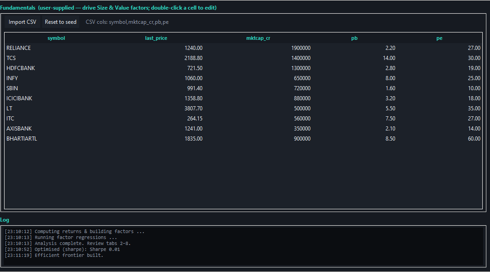
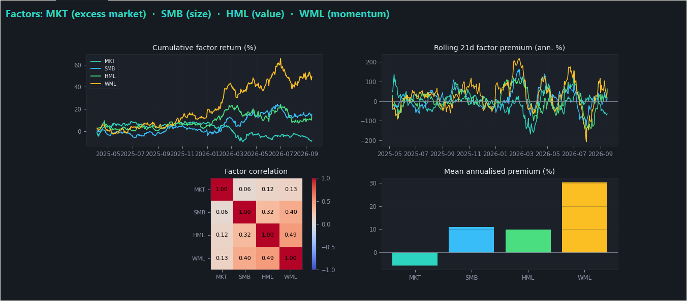
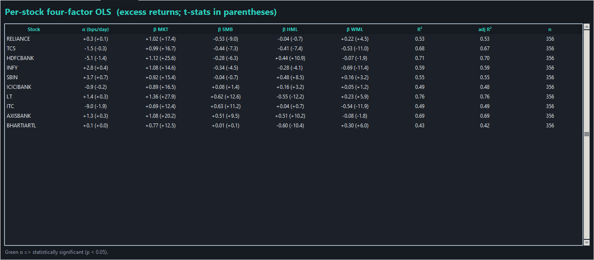
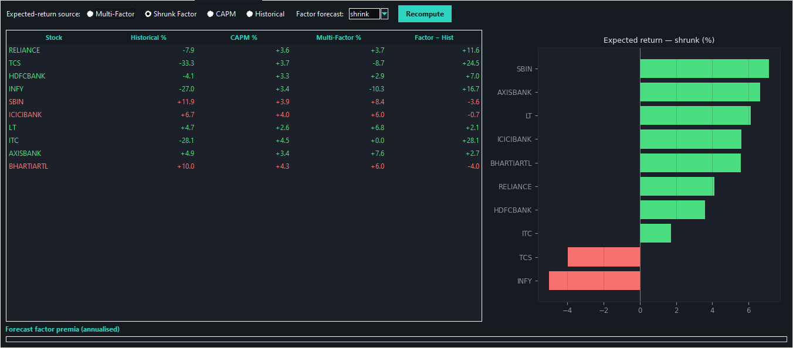
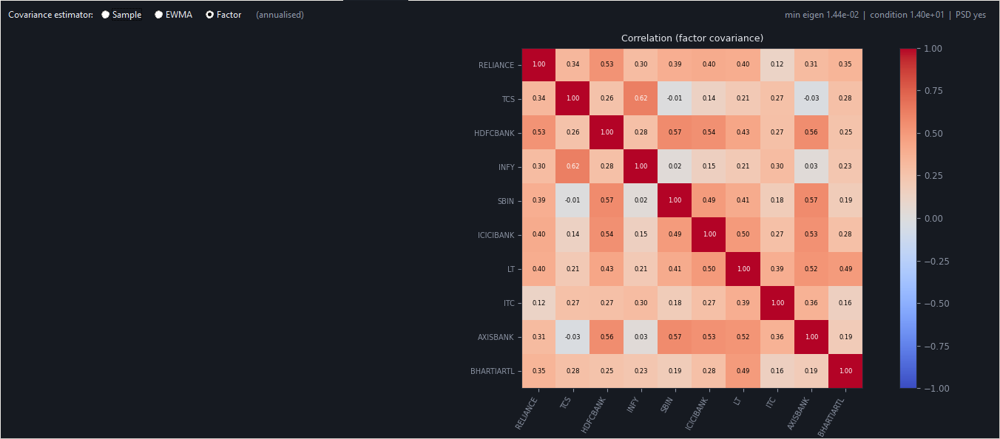
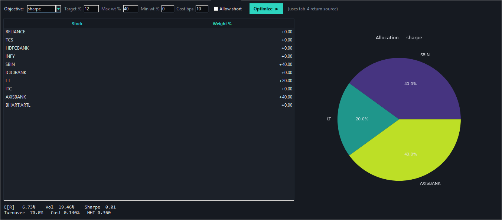
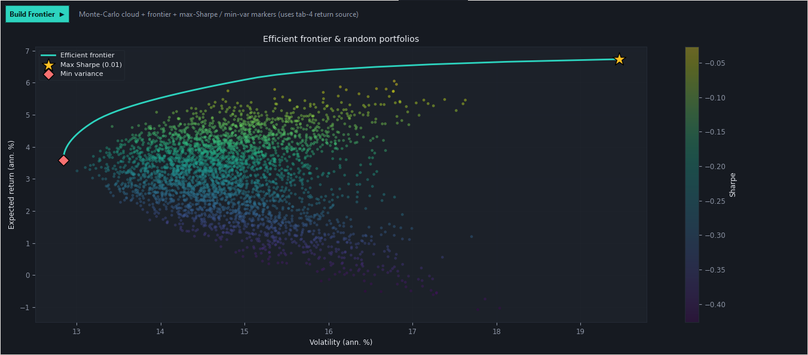
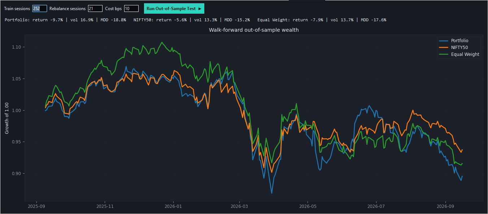
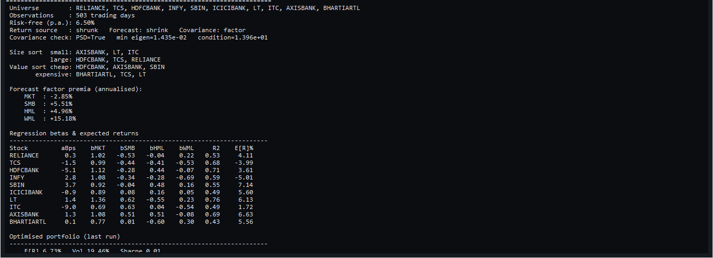
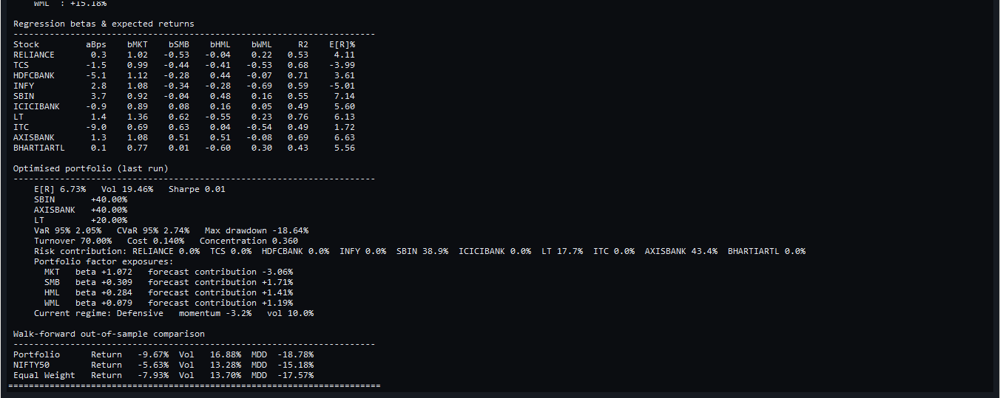

# Multi-Factor Portfolio Validation Terminal

A desktop quantitative-research application that estimates stock expected returns with a four-factor model and tests whether those estimates remain useful after portfolio constraints, trading costs, and out-of-sample validation.

The central question is: **can market, size, value, and momentum exposures produce a more defensible portfolio than relying on historical average returns alone?**

## What the project does

1. Loads a wide daily-price CSV or a reproducible demonstration dataset.
2. Uses market capitalization, price-to-book, and price-to-earnings inputs to form size and value portfolios.
3. Constructs MKT, SMB, HML, and WML factor returns without look-ahead leakage.
4. Fits a four-factor OLS regression to each stock's excess return.
5. Compares historical, CAPM, raw multi-factor, and shrunk multi-factor expected returns.
6. Estimates sample, EWMA, or factor-model covariance and verifies positive semidefiniteness.
7. Solves constrained maximum-Sharpe, minimum-variance, or target-return portfolios.
8. Builds an efficient frontier and evaluates the strategy in a rolling walk-forward test.
9. Exports portfolio weights and a research report with risk and factor attribution.

## Application walkthrough

### 1. Data Loader



The input layer validates prices and fundamentals, aligns symbols and dates, and prepares a clean return matrix. Fundamentals are supplied by the user and can be edited or imported from CSV.

### 2. Factor Builder



Stocks are sorted into size, value, and momentum groups. The program constructs self-financing SMB, HML, and WML spreads alongside the excess-market factor, then displays cumulative performance, rolling premiums, correlations, and mean annualized premiums.

### 3. Regression



For every stock, OLS estimates alpha, four factor betas, t-statistics, R-squared, adjusted R-squared, and usable observations. This explains *why* each stock's return differs rather than treating its history as one undifferentiated average.

### 4. Expected Return



The terminal compares four return sources. The primary research setting is **Shrunk Factor**: it starts from the four-factor forecast and pulls extreme estimates toward a cross-sectional target. Raw multi-factor estimates remain visible as a diagnostic comparison.

### 5. Covariance



Risk can be estimated using a sample matrix, exponentially weighted observations, or a factor covariance model. Eigenvalue and condition-number checks verify that the selected matrix is numerically suitable for optimization.

### 6. Optimizer



The optimizer supports maximum Sharpe, minimum variance, and target return objectives. Position limits, optional shorting, minimum weights, and transaction-cost penalties make the result more realistic than an unconstrained textbook solution.

### 7. Efficient Frontier



Random feasible portfolios are compared with the optimized frontier. Minimum-variance and maximum-Sharpe markers provide visual checks that the numerical solution lies on the efficient boundary.

### 8. Walk-Forward Validation



The model is repeatedly trained on past observations, rebalanced on a fixed schedule, charged transaction costs, and evaluated only on the next unseen period. It is compared with a broad-market benchmark and an equal-weight portfolio.

### 9. Report





The report consolidates model settings, factor premiums, regression exposures, optimized weights, VaR/CVaR, drawdown, concentration, turnover, factor attribution, market regime, and out-of-sample results.

## Methodology

For stock \(i\), the daily excess-return regression is:

\[
r_{i,t}-r_{f,t}=\alpha_i+\beta_{i,MKT}MKT_t+\beta_{i,SMB}SMB_t+\beta_{i,HML}HML_t+\beta_{i,WML}WML_t+\epsilon_{i,t}
\]

The factor forecast becomes a stock-level total expected return:

\[
\hat\mu_i=r_f+252\left(\alpha_i+\boldsymbol\beta_i^\top\mathbb{E}[\mathbf f]\right)
\]

Shrinkage regularizes noisy forecasts:

\[
\hat\mu_i^{shrunk}=(1-\gamma)\hat\mu_i+\gamma\mu_{target}
\]

The optimizer solves a constrained mean-variance problem with weights summing to one and user-defined position bounds. Reported Sharpe ratios use expected excess return over annualized volatility.

## Key result from the illustrated run

The constrained shrunk-factor portfolio allocated 40% to SBIN, 40% to AXISBANK, and 20% to LT, with an estimated return of 6.73%, volatility of 19.46%, and Sharpe ratio of 0.01 at a 6.50% risk-free rate.

The walk-forward test was intentionally less flattering: the portfolio returned -9.67% versus -5.63% for the benchmark and -7.93% for equal weight. That is an important finding—not a software failure. It shows that attractive in-sample factor relationships did not produce superior performance in that test window.

## Run locally

```bash
python -m venv .venv
# Windows: .venv\Scripts\activate
# macOS/Linux: source .venv/bin/activate
pip install -r requirements.txt
python multi_factor_portfolio_terminal.py --demo
```

Headless validation:

```bash
python multi_factor_portfolio_terminal.py --test
python multi_factor_portfolio_terminal.py --walk-forward
```

## Input formats

Price CSV: first column named `date`, followed by one adjusted-close column per symbol. Fundamentals CSV: `symbol,mktcap_cr,pb,pe`. See `sample_data/`.

## Limitations

- Demonstration software; not investment advice.
- Fundamental data must be point-in-time to avoid look-ahead bias.
- A small stock universe can make long-short factors unstable.
- Expected returns are estimation-sensitive; shrinkage reduces but does not eliminate uncertainty.
- The illustrated out-of-sample test underperformed both comparison portfolios.

## License

MIT License. See [LICENSE](LICENSE).

## Full project report

The illustrated methodology, codebase logic, tab-by-tab explanation, findings, and limitations are documented in [report/project-report.pdf](report/project-report.pdf).
